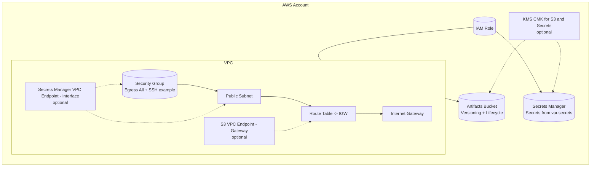

## Terraform AWS Template (Multi-Environment, Terraform Cloud state)

This is a reusable Terraform template for AWS. It’s organized by environment (e.g., `dev`, `prod`) and by concern (providers, variables, network, storage, IAM, secrets, outputs).

-  State is managed in Terraform Cloud (per environment folder).
-  Secrets are handled via AWS Secrets Manager and sensitive variables (`TF_VAR_...`).
-  You can copy an environment folder to spin up new stacks fast (e.g., `envs/stage`).

### What’s included

-  AWS provider configuration with default tags
-  VPC + Subnet + routing (IGW + route table) + example Security Group rules
-  S3 bucket for artifacts with versioning + lifecycle
-  IAM Role for workloads with optional managed policy attachments
-  Secrets Manager secrets from a sensitive map input
-  Clean outputs for critical resource identifiers
-  Makefile helpers for `init/plan/apply/destroy`

### Commenting and readability

This template is intentionally commented so you can explain the “why” and rationale:

-  Each `.tf` file begins with quick links to the official docs for that concern.
-  Provider blocks and locals explain how region and naming/tags are derived.
-  Network, Storage, IAM, and Secrets include rationale notes (security and ops tradeoffs).
-  Example stubs are commented out to show how to extend quickly (e.g., extra IAM, secrets).

If you add new resources, keep the same style: a header with links, short rationale comments, and clear variable usage.

### Quickstart

1. Prereqs

-  Terraform >= 1.6
-  AWS auth configured (one of):
   -  `aws configure` with access keys, or
   -  AWS SSO (`aws sso login`) with a profile, or
   -  Environment vars: `AWS_ACCESS_KEY_ID`, `AWS_SECRET_ACCESS_KEY`, optional `AWS_SESSION_TOKEN`
-  Terraform Cloud account and org ready

2. Configure Terraform Cloud per environment

-  Open `envs/dev/versions.tf` (and `envs/prod/versions.tf`) and set:
   -  `organization = "<your-tfc-org>"`
   -  `workspaces { name = "aws-ai-platform-dev" }` (or your naming)
-  Create matching workspaces in Terraform Cloud (or let `terraform init` prompt you)

3. Set your variables

-  Copy `envs/dev/terraform.tfvars.example` to `envs/dev/terraform.tfvars` and update values:
   -  `region`, `environment`, `vpc_cidr`, `subnet_cidr`, etc.
-  For secrets, prefer environment variables over files:
   -  Example:
      ```bash
      export TF_VAR_secrets='{"openai_api_key": "<YOUR_VALUE>"}'
      ```

4. Run

-  Dev:
   ```bash
   make init ENV=dev
   make plan ENV=dev
   make apply ENV=dev
   ```
-  Prod:
   ```bash
   make init ENV=prod
   make plan ENV=prod
   make apply ENV=prod
   ```

Optional quick checks:

-  Format and validate (per env):
   ```bash
   make fmt ENV=dev
   make validate ENV=dev
   ```

5. Create more environments

-  Copy `envs/dev` to `envs/<new>` (e.g., `envs/stage`)
-  Update:
   -  `versions.tf` workspace `name` to something unique (e.g., `aws-ai-platform-stage`)
   -  `variables.tf` default `environment = "stage"` (optional)
   -  `terraform.tfvars.example` to match

### Structure

```
.
├─ envs/
│  ├─ dev/
│  │  ├─ versions.tf          # Terraform settings + Terraform Cloud workspace
│  │  ├─ providers.tf         # aws provider + locals (default tags)
│  │  ├─ variables.tf         # Input variables
│  │  ├─ network.tf           # VPC, Subnet, IGW, Route Table, SG
│  │  ├─ storage.tf           # S3 bucket (+ versioning/lifecycle)
│  │  ├─ iam.tf               # IAM role + optional policy attachments
│  │  ├─ secrets.tf           # Secrets Manager
│  │  ├─ outputs.tf           # Outputs
│  │  └─ terraform.tfvars.example
│  └─ prod/ ...               # same layout
├─ docs/
│  ├─ RESOURCES.md            # Resource docs + common args
│  └─ AWS_CHEATSHEET.md       # AWS products quick links (AI platform engineer)
├─ .gitignore
└─ Makefile
```

### Secrets guidance

-  Prefer exporting sensitive values via environment variables so they never land in `.tfvars` or git:
   -  `TF_VAR_secrets` (JSON map) or define `secrets` inline for demo only
-  Secrets are created in AWS Secrets Manager (regional)
-  To reference a secret’s value in Terraform, you can use a data source or output carefully

### Terraform Cloud state

This template uses the `cloud {}` block in `versions.tf` under each environment. That means:

-  You must set your Terraform Cloud `organization`
-  The `workspaces.name` must exist (or be created)
-  Each environment folder can point to a different workspace (recommended)

Docs:

-  Terraform Cloud config: https://developer.hashicorp.com/terraform/language/settings/cloud

Terraform language and registry:

-  Terraform language reference: https://developer.hashicorp.com/terraform/language
-  Terraform Registry (search resources): https://registry.terraform.io/

### Architecture overview

This stack lays down a minimal, production-leaning foundation you can extend quickly:

-  Networking
   -  1 VPC with a single public subnet
   -  Internet Gateway and a route table for egress
   -  Security group with egress-all and an example SSH ingress rule (tighten in practice)
-  Storage
   -  1 artifacts S3 bucket with versioning and lifecycle (expire old noncurrent versions)
-  Identity
   -  1 IAM role for app workloads with optional managed policy attachments (e.g., S3 read)
-  Secrets
   -  Secrets Manager secrets created from a sensitive map input

#### Diagram (Mermaid)



Rendered image (optional)


How to export the diagram as PNG/SVG locally (optional):

```bash
# Install Mermaid CLI if needed
npm install -g @mermaid-js/mermaid-cli

# Export to PNG (from the repo root)
mmdc -i docs/diagrams/aws_architecture.mmd -o docs/diagrams/aws_architecture.png

# Or export to SVG
mmdc -i docs/diagrams/aws_architecture.mmd -o docs/diagrams/aws_architecture.svg
```

Notes:

-  The SSH rule is for demos; prefer SSM Session Manager or bastions, and limit sources.
-  Add private subnets, NAT Gateway, and ALB/NLB as needed; add EKS/ECS/Lambda/Batch per use case.
-  Use KMS CMKs for S3 and Secrets in regulated environments.

### AWS permissions you’ll need

-  On the target account/role, permissions sufficient to create the configured resources (e.g., `ec2:*` for VPC, `s3:*` for bucket, `iam:*` for role/policies, `secretsmanager:*` for secrets). In practice, scope down to least privilege.

### Common customization

-  Add more subnets/AZs and split public/private
-  Add bucket policies and KMS encryption
-  Expand IAM by attaching additional AWS-managed policies or custom policies
-  Add ECR, ECS/Fargate, EKS, Lambda, Step Functions, EventBridge, etc. as new files

### Reference documentation

-  Resource reference and common arguments: `docs/RESOURCES.md`
-  AWS products quick links (AI platform engineer): `docs/AWS_CHEATSHEET.md`

### Docs quick links (Terraform + AWS)

-  Terraform language
   -  Language reference: https://developer.hashicorp.com/terraform/language
   -  Variables: https://developer.hashicorp.com/terraform/language/values/variables
   -  Outputs: https://developer.hashicorp.com/terraform/language/values/outputs
   -  Locals: https://developer.hashicorp.com/terraform/language/values/locals
   -  Settings/Cloud backend: https://developer.hashicorp.com/terraform/language/settings/cloud
-  Provider
   -  AWS provider: https://registry.terraform.io/providers/hashicorp/aws/latest/docs
   -  default_tags: https://registry.terraform.io/providers/hashicorp/aws/latest/docs#default_tags-configuration-block
-  Networking (Terraform resources)
   -  VPC: https://registry.terraform.io/providers/hashicorp/aws/latest/docs/resources/vpc
   -  Subnet: https://registry.terraform.io/providers/hashicorp/aws/latest/docs/resources/subnet
   -  Internet Gateway: https://registry.terraform.io/providers/hashicorp/aws/latest/docs/resources/internet_gateway
   -  Route Table: https://registry.terraform.io/providers/hashicorp/aws/latest/docs/resources/route_table
   -  Route Table Association: https://registry.terraform.io/providers/hashicorp/aws/latest/docs/resources/route_table_association
   -  Security Group: https://registry.terraform.io/providers/hashicorp/aws/latest/docs/resources/security_group
   -  VPC Endpoint: https://registry.terraform.io/providers/hashicorp/aws/latest/docs/resources/vpc_endpoint
-  Networking (AWS product docs)
   -  VPC: https://docs.aws.amazon.com/vpc/
   -  VPC endpoints/PrivateLink: https://docs.aws.amazon.com/vpc/latest/privatelink/endpoint-services-overview.html
-  Storage (Terraform)
   -  S3 Bucket: https://registry.terraform.io/providers/hashicorp/aws/latest/docs/resources/s3_bucket
   -  Bucket Versioning: https://registry.terraform.io/providers/hashicorp/aws/latest/docs/resources/s3_bucket_versioning
   -  Bucket Lifecycle: https://registry.terraform.io/providers/hashicorp/aws/latest/docs/resources/s3_bucket_lifecycle_configuration
   -  Bucket SSE config (KMS): https://registry.terraform.io/providers/hashicorp/aws/latest/docs/resources/s3_bucket_server_side_encryption_configuration
-  Storage (AWS)
   -  S3 SSE overview: https://docs.aws.amazon.com/AmazonS3/latest/dev/UsingServerSideEncryption.html
-  IAM (Terraform)
   -  IAM Role: https://registry.terraform.io/providers/hashicorp/aws/latest/docs/resources/iam_role
   -  Role Policy Attachment: https://registry.terraform.io/providers/hashicorp/aws/latest/docs/resources/iam_role_policy_attachment
   -  IAM Policy (custom): https://registry.terraform.io/providers/hashicorp/aws/latest/docs/resources/iam_policy
-  IAM (AWS)
   -  Managed vs inline policies: https://docs.aws.amazon.com/IAM/latest/UserGuide/access_policies_managed-vs-inline.html
-  Secrets (Terraform)
   -  Secrets Manager Secret: https://registry.terraform.io/providers/hashicorp/aws/latest/docs/resources/secretsmanager_secret
   -  Secrets Manager Secret Version: https://registry.terraform.io/providers/hashicorp/aws/latest/docs/resources/secretsmanager_secret_version
-  Secrets (AWS)
   -  Secrets Manager: https://aws.amazon.com/secrets-manager/
